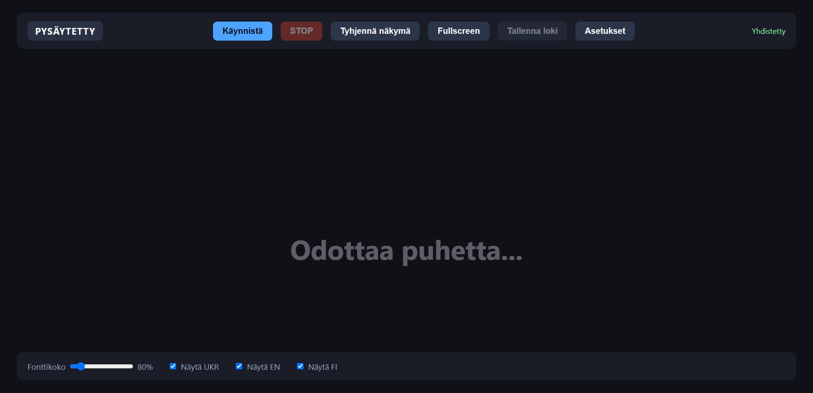
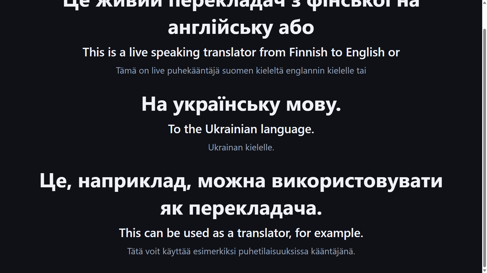

# Lokaali live-kääntäjä (suomi → englanti + ukraina)

Täysin lokaali Windows-sovellus, joka kuuntelee headset-mikrofonia, tunnistaa suomenkielisen puheen, kääntää sen englanniksi ja ukrainaksi, ja näyttää tuloksen selaimessa videoprojektorin käyttöön.

**Ei pilvipalveluja.** Kaikki käsittely tapahtuu omalla koneella mallien ensilatauksen jälkeen.

English documentation: [README.md](README.md)

## Mitä ohjelma tekee

```
Headset-mikrofoni
  → Python-backend (FastAPI, backend\.venv)
    → VAD (puheen tunnistus)
    → faster-whisper large-v3 (suomi → teksti, GPU)
    → hybrid-käännös (OPUS FI→EN + NLLB/OPUS → UK)
    → WebSocket
  → React/Vite-selainkäyttöliittymä
    → vierivä tekstilista / fullscreen-projektorinäyttö
```

**Prioriteetti:** suomen puheentunnistuksen laatu (Whisper large-v3, beam-haku, hotwords, ASR-korjaukset, lausekohtainen käännös). Tekstiä ei sensuroida — kaikki tunnistettu puhe näkyy sellaisenaan.

## Kuvakaappaukset

### Selainkäyttöliittymä



### Käännösnäkymä



## Pikakäynnistys

```powershell
cd live-speech-translator-fi
.\setup_backend.ps1
.\install_torch_gpu.ps1      # valinnainen, NVIDIA GPU
cd backend
.\check_gpu.ps1

cd ..\frontend
npm install

# Terminaali 1
cd backend
.\start.ps1

# Terminaali 2 (repo juuri)
.\start_frontend.ps1
```

Avaa **http://localhost:5173** → paina **Käynnistä** → puhu suomea kokonaisina lauseina.

Tarkemmat ohjeet: [docs/installation.fi.md](docs/installation.fi.md)

## Käyttö

1. Liitä headset-mikrofoni.
2. Käynnistä backend (`.\start.ps1`) ja frontend.
3. Avaa **http://localhost:5173** → paina **Käynnistä**.
4. Odota tila **KUUNTELEE**.
5. Puhu suomea selkeästi, mieluiten **kokonaisia lauseita** (1,5–6 s).
6. Näytöllä: ukraina (isoin), englanti (keskikoko), suomi (pienin). **Kaikki rivit pysyvät samankokoisina.**
7. Uusi lause ilmestyy alhaalle; vanhat rivit vierivät ylös sulavasti.
8. Paina **Fullscreen** → vain teksti keskellä ruutua (Esc poistuu).
9. Paina **STOP** kun valmis.
10. **Tallenna loki** tallentaa session tiedostoon.

### Selain-UI

| Ominaisuus | Kuvaus |
|------------|--------|
| Vierivä lista | Kaikki käännökset säilyvät; uusi rivi alhaalle, vanhat ylös |
| Kiinteä fonttikoko | Rivien koko ei muutu — vain sijainti vaihtuu |
| Sulava vieritys | Hidas animoitu scroll (~1,4 s) |
| Fullscreen | Kaikki painikkeet piiloon; vain teksti projektorille |
| Asetukset | Fonttikoko, näytettävät kielet (FI / EN / UKR) |
| Latenssi | Kokonaisaika millisekunteina työkalupalkissa |

## Dokumentaatio

| Aihe | Suomi | English |
|------|-------|---------|
| Asennus | [installation.fi.md](docs/installation.fi.md) | [installation.en.md](docs/installation.en.md) |
| Konfiguraatio | [configuration.fi.md](docs/configuration.fi.md) | [configuration.en.md](docs/configuration.en.md) |
| GPU / CUDA | [gpu-cuda.fi.md](docs/gpu-cuda.fi.md) | [gpu-cuda.en.md](docs/gpu-cuda.en.md) |
| Arkkitehtuuri | [architecture.fi.md](docs/architecture.fi.md) | [architecture.en.md](docs/architecture.en.md) |
| Vianetsintä | [troubleshooting.fi.md](docs/troubleshooting.fi.md) | [troubleshooting.en.md](docs/troubleshooting.en.md) |
| Tietosuoja | [privacy.fi.md](docs/privacy.fi.md) | [privacy.en.md](docs/privacy.en.md) |

Komponentit: [backend/README.md](backend/README.md) · [frontend/README.md](frontend/README.md)

## Lisenssi

MIT License — katso [LICENSE](LICENSE). Copyright (c) 2026 Marko Virta.
